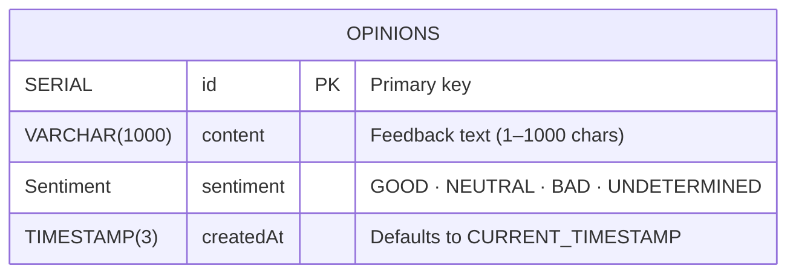
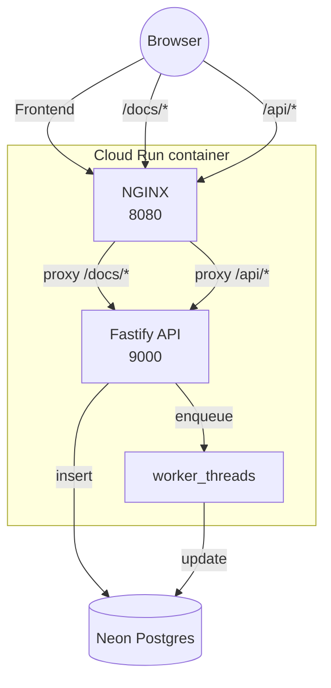

# feedback-service
A TypeScript REST micro-service that accepts customer feedback, saves it to a database, and asynchronously classifies each comment as Good, Neutral, or Bad.

Deployed at:
App:	    https://feedback-system-382890220864.europe-west1.run.app

OpenAPI:	https://feedback-system-382890220864.europe-west1.run.app/docs/

## System overview

| Step | What happens |
|------|--------------|
| **1. Public POST** → **`/api/feedback`** | Any user submits a plain-text string. |
| **2. Async sentiment** | A worker thread classifies the text using _NLP_ (0-20 s for very long passages) so the HTTP response is instant. |
| **3. Persist** | Text, sentiment and timestamp saved via Prisma into Neon Postgres. |
| **4. Admin view** | A password protected page for administrators showing every submission saved |

---

## Backend stack

| Concern | Library | Rationale |
|---------|---------|-----------|
| HTTP & routing | **Fastify** | Small, schema-driven |
| ORM / migrations | **Prisma** | Type-safe SQL, simple Neon deploys. |
| Sentiment NLP | **wink-nlp** | JS-only polarity scoring, lightweight. |

Fastify serves Swagger-UI at `/docs`

---

## Database
We chose PostgreSQL because it gives us typed enums for the Sentiment field, full ACID guarantees, effortless local-to-cloud parity (thanks to Neon’s free tier and Docker), first-class Prisma support, and a growth path from proof-of-concept to production without changing databases.

Regarding the schema:

| Choice                                                   | Reason                                                                                                               |
| -------------------------------------------------------- | -------------------------------------------------------------------------------------------------------------------- |
| **Single `Opinions` table**                              | One write path + one read path → no joins, simpler Prisma typing, cheapest on Neon’s free tier.                      |
| **`Sentiment` as native `ENUM`**                         | Compile-time safety; PostgreSQL stores it as an integer so equality filters & `GROUP BY` stay fast.                  |
| **Four buckets** (`GOOD / BAD / NEUTRAL / UNDETERMINED`) | Covers polarity plus a default for rows whose NLP job hasn’t finished yet.                                           |
| **`content VARCHAR(1000)`**                              | 1 000 chars ≈ 150–200 words—enough detail yet still under the 20 s CPU limit for wink-nlp on Cloud Run’s free share. |
| **`SERIAL id`**                                          | Simple auto-increment key, smaller than UUID, results in clean URLs (`/admin#42`).                                   |
| **`createdAt TIMESTAMP(3) DEFAULT now()`**               | Server timestamps the row; avoids trusting client clocks or needing a trigger.                                       |

---

## Frontend stack

* **Vite + React (Single Page application)** – built bundle lives under `/usr/share/nginx/html`.
* Pages  
  * `/`   public feedback form  
  * `/admin`   password box + “Load feedback”  
  * `/docs`   Swagger-UI
* NGINX proxies  
  * `/api/*` → Fastify  
  * `/docs/*` → Fastify  
  * everything else → SPA files

---

## CI (GitHub Actions)

For every Pull request CI runs on github actions to make sure changes won't break existing functionality or standards.

## Demo deployment

One-container proof-of-concept that lets anyone post feedback, classifies
its sentiment in the background, stores everything in Postgres and lets an
admin browse the results.  
Runs entirely on Google Cloud’s always-free tier.

# Routing diagram

## What’s still missing

| Area | Gap today | Next step |
|------|-----------|-----------|
| **Integration tests (real DB)** | Jest runs entirely on mocks; we’ve never hit an actual Postgres instance in CI. | We can use the `docker-compose.yml` where we already have (Fastify + Neon-compatible Postgres) and start it in GitHub Actions (`services:`). Run the same Jest suite with `DATABASE_URL` pointing at that container so migrations and Prisma queries execute for real. |
| **Sentiment sanity tests** | We unit-test the route but never assert that the used sentiment library assigns correct polarity. | Add a param-based test: feed known “good / bad / neutral” strings into the API, expecting the correct outcome in the response. Ensures the dictionary or preprocessing never regresses. |
| **Infrastructure as Code** | Cloud Run + Artifact Registry are created manually via CLI. | Write Terraform that provisions the service, IAM, Neon connection string, and a Cloud Build trigger. The same code can spin up staging and prod. |
| **UI polish** | Admin panel is minimal HTML + inline styles; public form is bare. | Use a component lib (e.g. shadcn/ui) for theming, add a “sentiment bar” in the table, real-time streaming via SSE or websockets, and field validation on the public form. |
| **True background workers** | NLP runs in in-process threads; if the instance scales to zero, work vanishes. | Publish the job to Cloud Pub/Sub; run a separate Cloud Run Job (or Cloud Function) subscribed to the topic. Lets workers autoscale independently, keeps API stateless. |
| **Observability** | Only console logs; no metrics, no tracing. | Add OpenTelemetry SDK to Fastify, export traces to Cloud Trace and metrics to Cloud Monitoring. Dashboards: request latency, worker queue depth, sentiment distribution. |

> **Takeaway:** the MVP proves the idea at \$0, but adding the points above turns it into a production-ready, observable, reproducible system.

